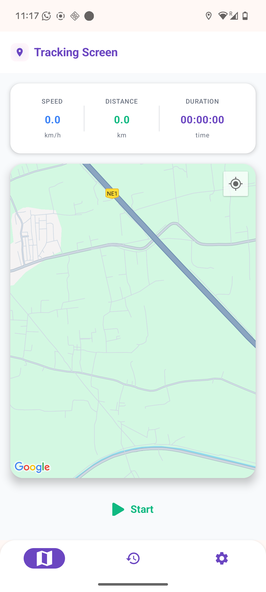
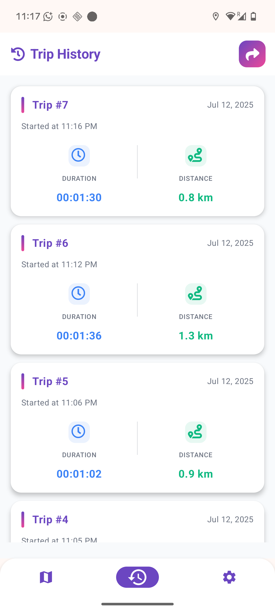
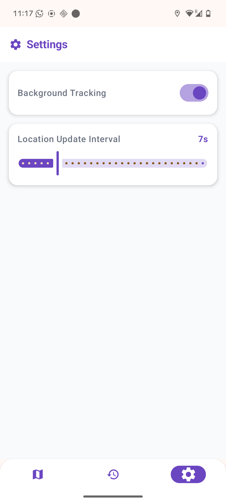

# GPS Tracking & Data Collection App

A modern Android application built to demonstrate best practices in Android development. Track your trips, view your history, and export your data with a clean, scalable, and maintainable codebase.

## 📸 Screenshots

| Tracking Screen | Trip History | Settings |
|:---:|:---:|:---:|
|  |  |  |


## 🎥 Video
[
<video src="media/video.mp4" controls width="100%" style="max-width:600px;">
  Your browser does not support the video tag.
</video>](https://github.com/user-attachments/assets/f12e74e6-2125-43de-8db0-2ea72218f6f9)

## ✨ Features

- **Live GPS Tracking**: Track your location in real-time on Google Maps
- **Real-time Metrics**: View live updates for speed, distance traveled, and trip duration
- **Trip History**: All your trips are saved and viewable in a comprehensive history list
- **Export Data**: Export your trip history to CSV or JSON format
- **Customizable Settings**:
  - Enable or disable background tracking
  - Adjust location update intervals
- **Modern UI**: Beautiful and responsive UI built with Material Design 3

## 🛠 Tech Stack & Architecture

This project follows official Android architecture guidelines and uses a modern tech stack.

### UI
- **Jetpack Compose**: Modern toolkit for building native Android UI
- **Material Design 3**: Latest Material Design components and theming

### Architecture
- **MVVM (Model-View-ViewModel)**: Separates UI from business logic
- **Multi-module Architecture**: Organized into modules for better separation of concerns (`app`, `core`, `data`, `features`)
- **Repository Pattern**: Clean API for data access through `TripRepository`

### Core Libraries
- **Kotlin Coroutines & Flow**: Asynchronous and reactive programming
- **Hilt**: Dependency injection for modular and testable code
- **Room**: Local data persistence for trip and location data
- **Jetpack Navigation Compose**: Screen navigation
- **Google Play Services & Google Maps Compose**: Location services and map display

## 🏗️ Project Structure

```
├── app/                    # Main application module
├── core/                   # Core business logic and utilities
├── data/                   # Data layer (Room database, DAOs, entities, repository)
└── features/               # Feature modules
    ├── tracking/           # Tracking screen, service, and components
    ├── trip_history/       # Trip history screen and ViewModel
    └── settings/           # Settings screen and configuration
```

## 🚀 Getting Started

### Prerequisites
- Android Studio (latest version)
- Android SDK
- Google Maps API Key

### Setup Instructions

1. **Clone the repository**
   ```bash
   git clone https://github.com/pingatkaran/gpstrackinganddatacollection.git
   cd gpstrackinganddatacollection
   ```

2. **Get a Google Maps API Key**
   - Follow the [Google Maps API documentation](https://developers.google.com/maps/documentation/android-sdk/get-api-key)
   - Enable the **Maps SDK for Android** in Google Cloud Console

3. **Add your API Key**
   - Open `app/src/main/AndroidManifest.xml`
   - Replace `YOUR_API_KEY_HERE` with your actual API key:
     ```xml
     <meta-data
         android:name="com.google.android.geo.API_KEY"
         android:value="YOUR_API_KEY_HERE" />
     ```

4. **Build and Run**
   - Open the project in Android Studio
   - Let Gradle sync the dependencies
   - Run the app on an emulator or physical device


